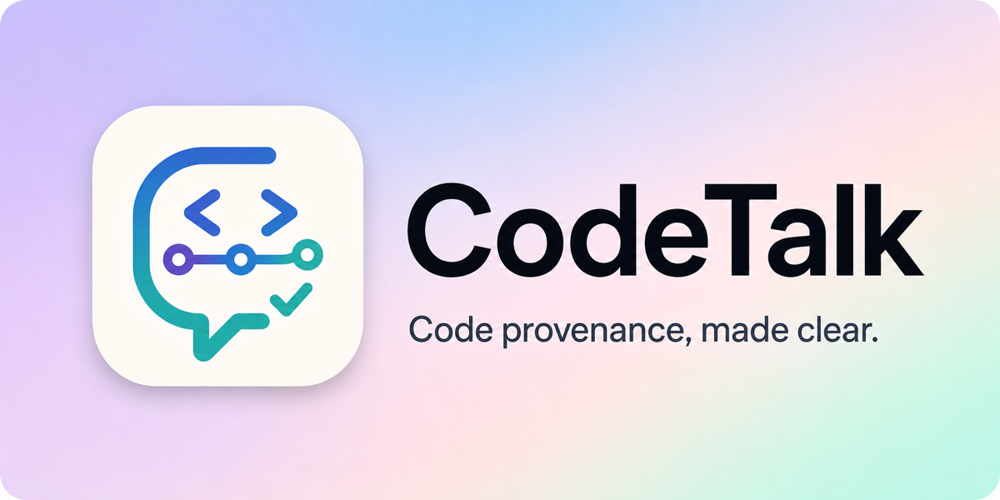
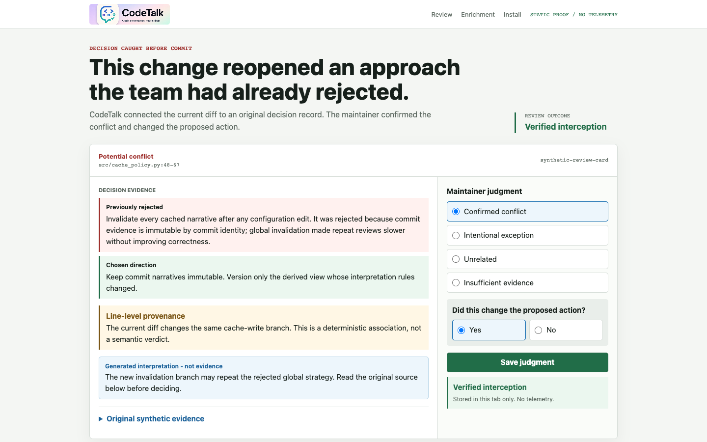
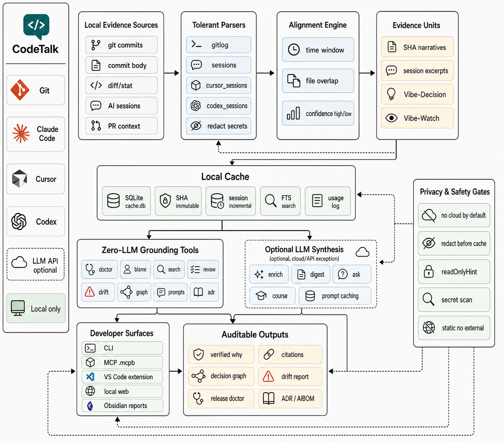

<p align="center">
  <a href="README.md"><b>English</b></a> · <a href="README.zh-CN.md">简体中文</a>
</p>

<p align="center">
  
</p>

<p align="center">
  <strong>Zero-LLM core · Real citations · Local cache · MCP / CLI / VS Code</strong>
</p>

**AI writes the change. CodeTalk brings back the decision that change may be repeating.**

CodeTalk reviews a local diff against real commit and session records before the
change ships. The core is zero-LLM, local-first, and pure standard library;
generated interpretation is labeled separately from evidence.

## 1. Review a change

This successful review caught a proposed global cache invalidation that the
team had already rejected. The maintainer opened the original source, confirmed
the conflict, and changed the action. CodeTalk records the human judgment; it
does not pretend a file-level association is a semantic verdict.



The sanitized, no-install product proof is [`index.html`](index.html). It uses
synthetic data, exercises all four judgment outcomes, and makes no external
runtime request. The same local workflow runs with:

```bash
codetalk review --serve --project .
```

## 2. Inspect enrichment

Optional model backfill starts with a local, no-request plan. It names the exact
destination, model, uncached scope, bounded inputs, redaction counts, cache
effects, data still visible after redaction, and the provider-retention boundary.
A configured key is not authorization.

```bash
codetalk enrich --project .                    # local evidence + no-request plan
codetalk enrich --project . --payload-preview  # one redacted payload, no send
codetalk enrich --project . --allow-remote     # authorize this remote run only
```

**Secret redaction is not anonymization.** Ordinary code, business logic,
filenames, author data, and non-secret conversation text may remain visible to
the selected provider. Generated narratives remain interpretation, not decision
evidence.

## 3. Install

```bash
pipx install hukair-codetalk
```

Requires Python 3.11+. The PyPI distribution is `hukair-codetalk`; the installed
command remains `codetalk`. One alternative installer is
`uv tool install hukair-codetalk`. Then run `codetalk doctor --project .` to
inspect local evidence coverage, or open the review workflow shown above.
Optional Anthropic synthesis is available through the package extra after the
core install.

## Deeper documentation

| Need | Start here |
|---|---|
| Full CLI surface | [Commands](#commands) |
| MCP client setup | [MCP installation](docs/mcp-install.md) |
| VS Code / Cursor / Windsurf | [IDE extension](#ide-extension-vs-code--cursor--windsurf) |
| Privacy and persistence | [Cache & privacy](#cache--privacy) |
| Spec-driven workflows | [Spec Kit integration](docs/spec-kit-integration.md) |
| Architecture and vocabulary | [Pipeline](#pipeline) · [Terms](#what-these-terms-mean) |

### Why this matters

- **Trust is collapsing.** 46% of developers actively distrust AI output; only 3% highly trust it. *(Stack Overflow 2025, N=33,244)*
- **AI "explanations" are fabricated.** We blind-tested 5 real commits: AI inferred "why" from diffs alone — **5/5 missed the real decisions, 2/5 completely wrong.** *(This repo, reproducible: `python3 scripts/blind_test.py . 5`)*
- **Chat history is fragile.** Coding-agent conversations can disappear from their UI even while local records remain. CodeTalk makes the source record independently retrievable and verifiable.

### How CodeTalk is different

| | AI inference from a diff | CodeTalk |
|---|---|---|
| Source | current code | real commit + session record |
| Method | model guesses why | deterministic lookup by commit identity |
| Verifiable | plausible prose | original source available beside the card |
| Judgment | model conclusion | maintainer chooses one of four outcomes |
| Data | provider-dependent | local by default; remote enrichment needs per-command authorization |

## On your own repo

```bash
codetalk doctor --project .
codetalk review --serve --project .
codetalk install-agent-seed --project .
```

**Honest cold-start:** a repository with no decision notes and no enrichment has
only commit subjects, similar to `git log`. Decision notes capture future why at
commit time; inspectable enrichment can backfill generated interpretation for
older commits. CodeTalk finds what was recorded, not whether the code or record
is correct.

## Build and install the MCP bundle (.mcpb)

Expose the zero-LLM grounding capability to MCP clients such as Claude Code / Cursor / Codex, so you can ask "why was this code written this way" inside your agent workflow. CodeTalk's core is pure standard library, so it packs into one `.mcpb` containing the manifest and source. The built file is drag-to-install; until a downloadable GitHub Release exists, a source checkout must build it once. It uses the installed `python3` and **does not bundle an interpreter**:

```bash
python3 -m scripts.build_mcpb     # produces dist/codetalk-0.3.1.mcpb
```

Drag `codetalk-0.3.1.mcpb` into your client's extension-install entry point, and pick a project root during installation. It exposes **7 tools** (all marked `readOnlyHint: true`, so Claude Code / Cursor can auto-approve them without a confirmation prompt):

| Tool | Purpose | LLM |
|---|---|---|
| `codetalk_ask` | Grounded question "why was this written" | Uses LLM if a key is set; falls back to deterministic without one |
| `codetalk_blame` | Line-level decision provenance | Zero LLM |
| `codetalk_graph` | Decision-impact graph (timeline DAG) | Zero LLM |
| `codetalk_search` | Topic-level "why" retrieval | Zero LLM |
| `codetalk_drift` | Drift self-check: recorded agent writes with no later same-path commit | Zero LLM |
| `codetalk_prompts` | Instruction recall: what you told the AI to do | Zero LLM |
| `codetalk_adr` | ADR export: MADR / Nygard / CycloneDX (AIBOM) | Zero LLM |

> Step-by-step install, self-check, and troubleshooting per client: **[`docs/mcp-install.md`](docs/mcp-install.md)**.
> Spec-driven workflow integrations (GitHub Spec Kit / AWS Kiro / OpenSpec / Antigravity):
> **[`docs/spec-kit-integration.md`](docs/spec-kit-integration.md)**.

## IDE Extension (VS Code / Cursor / Windsurf)

Foldable decision CodeLens + hover cards — see **why** a line was written that way, with real commit citations. Like GitLens but for decisions, not just authorship.

```bash
cd vscode-codetalk
npm install && npm run build                        # build
npm run package                                      # package the .vsix
```

Install (pick one):

```bash
cursor --install-extension vscode-codetalk-0.3.1.vsix   # Cursor
code --install-extension vscode-codetalk-0.3.1.vsix      # VS Code
# Windsurf: Extensions → Install from VSIX → pick the file
```

After installing, run Cmd+Shift+P → **Reload Window**, then open a project that has a CodeTalk cache to see the expandable decision CodeLens; hover a line to view the full card.

| Setting | Default | Description |
|---|---|---|
| `codetalk.enabled` | `true` | Master switch |
| `codetalk.pythonPath` | `"python3"` | Path to the Python interpreter that has CodeTalk installed |

> Detailed install + troubleshooting + configuration: **[`vscode-codetalk/README.md`](vscode-codetalk/README.md)**.

## codetalk web — self-hosted grounded conversation

A local-first interactive web page: hold a multi-turn discussion with an LLM about "why was this code written this way", but on every turn it **first runs a zero-LLM retrieval over your project's real records** (commit narratives / decision notes / verbatim session transcripts), feeds that real evidence to the model, and puts **side-by-side verifiable citations** next to the answer. The discussion itself is redacted before being stored, feeding back into future `ask` / `search`. It is software you run, not a hosted service.

```bash
pip install -e ".[web]"                            # optional web extra (FastAPI/uvicorn; CLI/MCP stay pure stdlib)
codetalk web --project /path/to/repo              # binds 127.0.0.1, auto-opens the browser, verbatim streaming
codetalk web --project /path/to/repo --no-llm     # zero egress: falls back to a zero-LLM grounded listing
```

- **Grounded and verifiable**: answers are anchored to real commits / decisions / verbatim session transcripts, and the citation next to each conclusion can be clicked to verify — this is the line that separates it from a "chat wrapper"; **the model won't answer when detached from real material** (empty material → the model isn't called, just a deterministic listing). Each commit citation carries a **`diff ▾`** button that opens the real `git show` in-browser (zero-LLM, local) — the "click the SHA to verify" loop, now in the web UI.
- **All views are browser-reachable**: besides `/` (chat), the server serves `/console` (unified console), `/tunnel` (timeline), `/graph` (decision-impact DAG), and `/course` (evolution course) — the same rich views the CLI writes as static files. A header **EN / 中文** toggle switches the whole UI language (persisted locally; defaults to the browser language).
- **Privacy red lines**: by default it only binds `127.0.0.1`, never phones home (except the LLM call), redacts before going out to the network and before persisting, and the frontend has zero external links (CSP `connect-src 'self'`; static artifacts are guarded by `scripts/check_static_no_external.py`); the backend rejects non-loopback Host and cross-Origin requests, preventing other web pages from using localhost to trigger local retrieval / LLM calls.
- **Self-host**: single-image Docker (see `Dockerfile`: `docker build -t codetalk .` → `docker run`).

## Configuration

```bash
codetalk init        # write a config template to ~/.codetalk/config.json (auto chmod 600)
```

`~/.codetalk/config.json`:

```json
{
  "vault_path": "/path/to/obsidian/vault/folder",
  "provider": "deepseek",
  "model": "deepseek-v4-pro",
  "diff_token_budget": 3000,
  "output_lang": "中文",
  "providers": {
    "deepseek":  {"base_url": "https://api.deepseek.com/v1", "api_key": "sk-..."},
    "openai":    {"base_url": "https://api.openai.com/v1", "api_key": ""},
    "qwen":      {"base_url": "https://dashscope.aliyuncs.com/compatible-mode/v1", "api_key": ""},
    "kimi":      {"base_url": "https://api.moonshot.cn/v1", "api_key": ""},
    "doubao":    {"base_url": "https://ark.cn-beijing.volces.com/api/v3", "api_key": ""},
    "glm":       {"base_url": "https://open.bigmodel.cn/api/paas/v4", "api_key": ""},
    "grok":      {"base_url": "https://api.x.ai/v1", "api_key": ""},
    "gemini":    {"base_url": "https://generativelanguage.googleapis.com/v1beta/openai", "api_key": ""},
    "anthropic": {"api_key": ""},
    "ollama":    {"base_url": "http://localhost:11434/v1", "api_key": "ollama"}
  }
}
```

To switch models: change the top-level `provider` to any of the above and set the matching `model` (e.g. kimi→`kimi-k2-0905-preview`, glm→`glm-4.6`, grok→`grok-4`, gemini→`gemini-2.5-pro`, doubao→endpoint ID or `doubao-seed-1-6`). The API key can also come from the environment variable `<PROVIDER>_API_KEY` (e.g. `DEEPSEEK_API_KEY` / `KIMI_API_KEY` / `GLM_API_KEY` / `GROK_API_KEY` / `GEMINI_API_KEY` / `DOUBAO_API_KEY` / `ANTHROPIC_API_KEY`). Except for anthropic, which goes through the official SDK (json_schema structured output + prompt caching), everything else uses the OpenAI-compatible protocol (stdlib urllib, zero extra dependencies; DeepSeek context caching kicks in automatically).

**Zero-egress local inference**: set `provider` to `ollama`, or configure an OpenAI-compatible endpoint whose parsed hostname is exactly `localhost`, `127.0.0.1`, or `::1` (for example LM Studio / llama.cpp / vLLM). CodeTalk does not trust a `local` label or a hostname that merely contains `localhost`. Synthesis then runs on your machine, so the LLM call stays off the network. Together with `--no-llm` (never call an LLM at all), this forms a two-tier privacy gradient.

**Inspectable remote enrichment**: plain `codetalk enrich` does not call a
remote model, even when its API key is configured. Its plan names the provider,
exact destination origin, model, uncached scope, bounded input categories,
redaction counts, and cache effects. Secret-pattern redaction does not make code
anonymous: ordinary code, business logic, filenames, author data, and
non-secret conversation text may remain visible to the selected provider.
Provider retention is controlled by that provider and is outside CodeTalk's
guarantees. Use `--allow-remote` only after reviewing the plan or
`--payload-preview` output. Exact parsed loopback endpoints remain local and do
not require remote authorization.

## Commands

| Command | What it does | Example |
|---|---|---|
| `doctor` | **First-run diagnosis**: evidence coverage, session sources, LLM config status, and next-step suggestions (**pure local, zero LLM**) | `codetalk doctor --project .` |
| `review` | Turn the current diff into focused decision-review cards; terminal, JSON, or local browser (**zero LLM**) | `codetalk review --serve --project .` |
| `digest` | Enrich a span of commits + sessions into a **change-narrative daily report** (anti-hallucination, letter style, embedded time capsules) | `codetalk digest --since "3 days ago"` |
| `enrich` | Backfill local evidence, show an inspectable no-request plan, and optionally create generated narratives with explicit per-command remote authorization | `codetalk enrich --project . --payload-preview` |
| `brief` | **Kickoff brief**: where you left off + top 3 understanding debts (**pure local, zero LLM**); `--all` gives a **cross-project overview** (across all projects: those with due capsules + those with the highest understanding debt, ordered by urgency) | `codetalk brief` · `codetalk brief --all` |
| `graph` | **Decision-impact graph**: which decision drove which later changes (timeline DAG, **zero LLM**; `--canvas` exports an Obsidian Canvas) | `codetalk graph --canvas` |
| `course` | **Evolution course**: how the project grew into what it is, step by step (chaptered + plain-language + scenario quizzes, single-file HTML) | `codetalk course` |
| `ask` | **Ask about a piece of code**, with answers wired to project memory (narratives + decision notes), citing real commits | `codetalk ask codetalk/llm.py:72-78 "why written this way"` |
| `console` | **Unified console (web entry)**: overview / timeline / decision graph / understanding debt / file tree / prompt replay — six views on one page (**zero LLM**; `--serve` writes capsules back) | `codetalk console --serve` |
| `tunnel` | **Timeline**: a linear commit timeline, newest on top, grouped by day, click to read the narrative (`--serve` writes capsule answers back instantly) | `codetalk tunnel` |
| `install-hook` | Install a git hook that prompts for all three `Vibe-*` decision-note types when hand-writing a commit | `codetalk install-hook` |
| `install-agent-seed` | Append the decision-note convention to `CLAUDE.md`, `AGENTS.md`, `.cursorrules`, `.cursor/rules/codetalk.mdc`, and `.github/copilot-instructions.md` (idempotent; existing content is preserved) | `codetalk install-agent-seed` |

`digest` output: `<vault>/YYYY-MM-DD-<project>.md` — a-year-ago-today / a-month-ago-today reflowed → today's overview (letter style) + today's decisions → due time capsules (to backfill) → per-commit narratives → an open-loop summary → run stats. Time capsules seal each risk for 21 days and, when due, bring it back in front of you in the daily report, closing the "predict → verify" loop.

### Decision Notes (make `ask` / `graph` sharper)

When you make a key technical tradeoff, leave a line in the commit message body:

```
Vibe-Decision: Used urllib instead of a third-party lib — M0 forbids third-party deps
Vibe-Rejected: Added another HTTP library — it would break the zero-dependency core
Vibe-Watch:    Living with this for now; concurrency safety still unverified
```

`Vibe-Decision` records the chosen path, `Vibe-Rejected` preserves a considered alternative and why it lost, and `Vibe-Watch` records a risk that can return as a verification capsule. `ask`, `blame`, and `review` surface these lines with their commit SHA; `graph` uses decisions to connect impact edges. Prefixes match exactly at line start and are case-sensitive.

Committers who hand-write commits (without `-m`) can run `codetalk install-hook` once to install the `prepare-commit-msg` hook. The editor prompts all three lines; completed lines stay in the commit message, while blank commented lines are stripped by git. Git hooks aren't version-controlled, so **install once per clone**.

## Cache & privacy

- Commit narratives are cached by SHA in `~/.codetalk/cache.db` and **never recomputed**; re-running the same day's digest is 0 LLM calls and sub-second. `graph:` / `course:` / `ask:` derived results are cached in the same table under prefixed keys.
- Session parsing is incrementally cached by (session_id, mtime, size); every run's parameters are appended to `~/.codetalk/usage.log`.
- **Remote `enrich` transfer is off by default.** It requires `--allow-remote`
  on that command; an API key is configuration, not consent. Other commands
  with optional model features follow their documented/configured behavior.
  Before a permitted model call and before writing the cache / vault / HTML,
  common secret patterns (API key / token / JWT / private key / Google / Stripe /
  Slack ...) are redacted. Redaction is not anonymization; inspect the listed
  visible categories and provider-retention boundary in the enrichment plan.
- **`no_llm` hard switch**: turn off even that "LLM call" exception to **guarantee zero egress**. Any of three ways takes effect, applying globally (including the MCP `ask` tool): set `"no_llm": true` in config.json, set the environment variable `CODETALK_NO_LLM=1`, or pass `--no-llm` to `digest`/`enrich`/`ask`/`course`/`web`. Once on, blame/graph/search/brief/prompts work as usual, ask/course/MCP ask fall back to deterministic retrieval, enrich keeps its local evidence pass and plan, and digest — which must use an LLM — exits directly (clearly stated, never silent).

## Known limitations (M0)

- The session source is not a complete audit log: Claude main sessions and `*/subagents/**/agent-*.jsonl` are included, but side files like journal/meta are not collected; Cursor / Codex local session sources are opt-in and depend on unofficial local formats.
- Session-to-commit alignment is a soft association (±30-minute time window + file intersection), targeting 80% accuracy, annotated with high/low confidence — **not guaranteed to be all correct**.
- Once a commit is amended / rebased and its SHA changes, it's treated as a new commit; the old SHA's cache becomes dead data.
- `graph`'s file-level edges get dense on very small projects and are suppressed with sparse nodes; line-level precision is deferred as a non-goal.
- The local session formats of Claude Code / Cursor / Codex are all unofficial, non-stable APIs; a version upgrade may break parsing — the parser ignores unknown fields and degrades on missing ones, worst-case falling back to pure-git mode.

## Pipeline

CodeTalk is a local evidence pipeline. It reads git history and AI coding
session files, parses them defensively, aligns sessions to commits, stores
redacted evidence in a local SQLite cache, then exposes deterministic review
and retrieval tools. Optional model synthesis sits behind that evidence layer.



### What These Terms Mean

- **Decision notes** (called breadcrumbs internally) are three optional line
  types in a git commit message: `Vibe-Decision: ...` records what was chosen
  and why, `Vibe-Rejected: ...` records a seriously considered alternative and
  why it was rejected, and `Vibe-Watch: ...` records a risk to check later.
- **Grounding evidence** is material CodeTalk can cite directly: commit
  messages, decision notes, tests, pull requests, and verbatim local session
  excerpts. If no evidence exists, CodeTalk reports the gap instead of
  inventing an answer.
- **Generated interpretation** is optional model-written context. It is shown
  separately and never promoted to decision evidence.
- **Zero-LLM / zero egress** means local deterministic lookup only. `--no-llm`
  disables optional model calls across supported commands.
- **Time capsule** brings a `Vibe-Watch` risk back later so a maintainer can
  record what happened.
- **MCP** exposes CodeTalk's tools inside coding clients such as Claude Code,
  Cursor, and Codex.
- **Understanding debt** prioritizes files or decisions that changed recently,
  carry open risks, or have not been reviewed.

> **Honest boundaries:** CodeTalk retrieves what was actually recorded; records
> can still be incomplete or wrong, and semantic applicability remains a human
> judgment. The repository blind test is N=5 and human-judged, not a population
> claim. Run `python3 scripts/blind_test.py . 5` and
> `python3 scripts/grounding_hitrate.py .` to reproduce the current evidence.

## Architecture

```
cli → gitlog (commit/diff/line history/decision notes) ─┐
      sessions (Claude/Cursor/Codex, fault-tolerant) ─┼→ align (soft assoc.) → enrich (LLM, SHA cache) → report → vault
      cache (SQLite single source of truth)          ─┘
Zero-LLM tools: brief / debt / graph read cache + git directly, bypassing enrich/llm.
Unified LLM wrapper: llm.py (multi-provider / retry / token log / prompt caching / anti-hallucination + style discipline).
```

## Design philosophy (M0)

The core CLI/MCP surface stays on standard library + anthropic SDK (optional); LangGraph / vector DBs / heavy frontend chains are **forbidden**. `codetalk web` is an optional web extra — only that surface allows FastAPI / uvicorn, and it's lazily imported so it doesn't pollute the core dependencies. Modules stay <300 lines; parsing external data is always fault-tolerant, degrading on failure and never crashing. Behavioral guidelines are in `CLAUDE.md` (Karpathy coding discipline: think before writing / simplicity first / surgical changes / goal-driven).

## Release & contributing

- Release readiness review: [`docs/release-readiness-review.md`](docs/release-readiness-review.md)
- Pre-release checks: [`RELEASE_CHECKLIST.md`](RELEASE_CHECKLIST.md)
- Change log: [`CHANGELOG.md`](CHANGELOG.md)
- Contribution constraints: [`CONTRIBUTING.md`](CONTRIBUTING.md)
- Security reports: [`SECURITY.md`](SECURITY.md)
