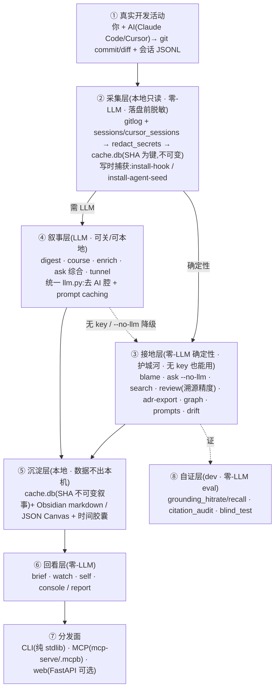

# vibetrace · 产品介绍与功能链条

## 一句话

**vibetrace —— 本地优先的 AI 编码认知层 / 代码考古 CLI。** 回答「这段代码当初为什么这么写」:
**零-LLM 确定性接地**到你项目里真实的 commit / PR / 会话原话 + 决策面包屑,**对抗 AI 反推式编造**。

别人要你**手写**决策记录(ADR / Notion);vibetrace 从你已有的 `git log` + Claude Code/Cursor 会话里
**自动挖出「当初为什么」并逐字接地**。关掉大模型照样有价值(`blame`/`graph`/`search`/`brief` 纯零-LLM)。
**数据不出本机**(LLM 调用是唯一例外,且落盘/出网前脱敏)。

## 护城河(复合,别人难同时给齐)

① 零-LLM 确定性 · ② 逐字引真实记录(可点开核验,不是 LLM 重述)· ③ 自动挖掘(非手写)· ④ 数据不出本机。
为什么非引真实记录:有三类 why **结构性**不在 diff 里——why-NOT/被否决备选、diff 不可见的外部约束、
待验证项;让 AI 从 diff 反推只能**编**。(本仓干净样本盲测实测:纯 diff 反推 3/3 漏真决策、含幻觉数字。)

## 功能清单(按链条分层)

| 层 | 命令 | 说明 |
|---|---|---|
| **采集**(零-LLM,落盘前脱敏) | `install-hook` · `install-agent-seed` | 写时留决策面包屑(Vibe-Decision/Rejected/Watch) |
| **接地**(零-LLM 确定性,护城河,无 key 也能用) | `blame` · `ask --no-llm` · `search` · `review` · `adr-export` · `graph` · `prompts` · `drift` · `mcp-serve` | 引真实 commit/PR/会话原话 + 面包屑;review 带溯源精度;drift 报「声称 vs 实际」;mcp-serve 暴露给 Claude Code/Cursor |
| **叙事**(LLM,可关/可本地) | `digest` · `course` · `enrich` · `ask` · `tunnel` | 统一 llm.py:去 AI 腔文风纪律 + prompt caching;无 key/`--no-llm` 降级回接地层 |
| **沉淀**(本地) | (cache.db SHA 不可变叙事) · `graph --canvas` | Obsidian markdown / JSON Canvas + 时间胶囊(预测-验证) |
| **回看**(零-LLM) | `brief` · `watch` · `self` · `console` · `report` | 开工简报 / 待验证收件箱 / 自我周报 / 单页 web 看板 |
| **分发** | CLI(纯 stdlib)· `mcp-serve`(.mcpb)· `web`(FastAPI 可选,绑 127.0.0.1) | |
| **自证**(dev · 零-LLM eval) | `scripts/grounding_hitrate` · `grounding_recall` · `citation_audit` · `blind_test` | 自证「关掉 LLM 仍有价值 / 接地真实」 |

## 功能链条图(Mermaid · Obsidian/GitHub 原生渲染;PNG 见另发)

**闭环**:真实记录 → 零-LLM 接地引原话 →(可选 LLM 综合)→ 沉淀 Obsidian/胶囊 → 回看,
对抗「AI 事后编 why」、偿还 AI 高速写码欠下的理解债。

> 开源策略 / license / 时机的 PM 建议见 deep-research 产出(单独成文)。
